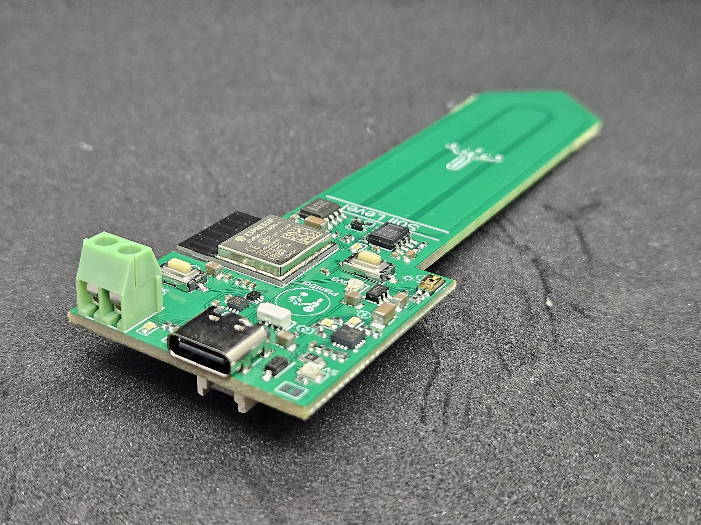
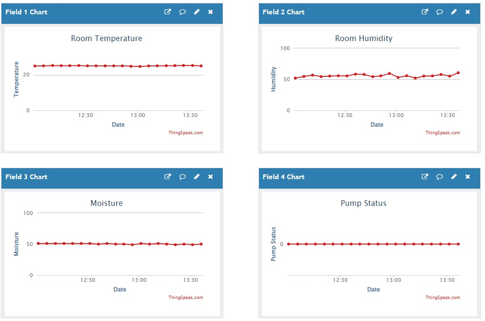
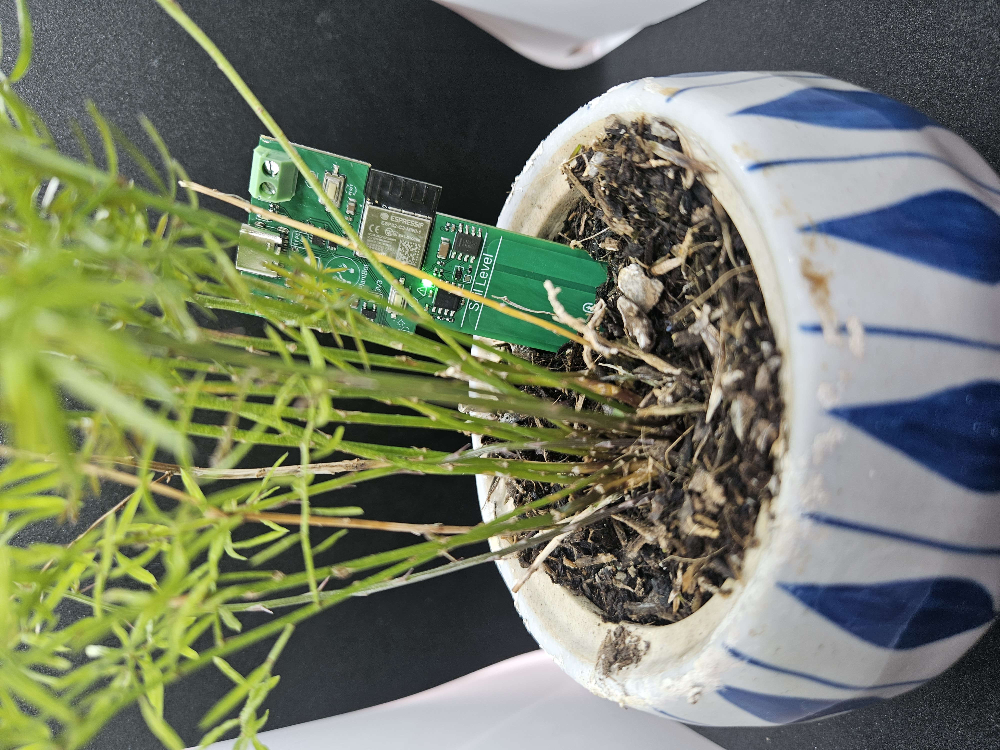

# Plant Bot: Automate Plant Care 🌱

## High-Level Summary

Plant Bot is a cutting-edge device designed to revolutionize plant care. Powered by USB, it seamlessly integrates into your pot, transforming it into an active participant in plant care. With features like a moisture sensor, integrated pump driver, and multi-color LED control, it's the ultimate companion for every plant enthusiast.

---

## Detailed Description

### What is it?

Plant Bot is not just a device; it's a solution to modern plant care challenges. Designed for both casual plant owners and enthusiasts, it offers:

- **Corrosion-Resistant Capacitive Moisture Sensor:** Say goodbye to guesswork. Know exactly when your plant needs water.
- **Integrated Pump Driver & LED Control:** Automated care with visual feedback. The LED's color spectrum ranges from red (indicating dry soil) to blue (indicating moist soil).
- **Connectivity:** With both WiFi and Bluetooth capabilities, stay connected with your plants from anywhere.
- **Battery-Powered Operation:** Designed as a low-power IoT device, ensuring longevity and reliability.

Leveraging open-source projects, Plant Bot supports programming via Micropython and Arduino. For advanced users, the ESP-IDF tool offers maximum customization.

---

## Use Cases

### Fully Automated Plant Care

The sample code provided showcases Plant Bot's capabilities in measuring soil moisture and light levels, taking actions based on the data. The intuitive LED color spectrum offers a visual representation of soil conditions, while an additional LED signals pump activation for hydration. Built on the ESP32 platform, it boasts comprehensive connectivity, transmitting data to platforms like Thingspeak.

### Connected Plant Node

Harness the power of Plant Bot's low-power design to connect your plants to the internet wirelessly. Demos are available that allow Plant Bot to send Telegram notifications or relay measurements to IoT platforms. With efficient power consumption, a single coin cell battery can last up to a week with daily updates.

---

## How to Run the Demo Script

1. **Setup:** Ensure you have the Arduino IDE installed on your computer.
2. **Connect:** Plug in your ESP32-C3 device to your computer via USB.
3. **Integrated JTAG:** Ensure the JTAG is setup. In Tools, "USB CDC On Boot" is Enabled and JTAG Adapter is USB JTAG Adapter.
5. **Load Script:** Open one of the demo script provided in the Arduino IDE.
6. **Select Board:** From the 'Tools' menu, select 'Board' and choose 'ESP32-C3'.
7. **Select Port:** Select the port for the Plant-Bot device, if nothing pops up, unplug the device, hold the settings button and plug it back into the computer while still holding the button. It should appear now.
8. **Upload:** Click on the 'Upload' button to program the ESP32-C3.
9. **Monitor:** Open the Serial Monitor to view outputs and ensure the script runs successfully.

For any issues or further instructions, please refer to the documentation or raise an issue in the repo.

---

**Acknowledgments:** A special thank you to JLCPCB for their unwavering support throughout this project. Their expertise in rapid prototyping without compromising on quality has been invaluable.

## License

MIT License

Copyright (c) 2023 elektroThing

Permission is hereby granted, free of charge, to any person obtaining a copy
of this software and associated documentation files (the "Software"), to deal
in the Software without restriction, including without limitation the rights
to use, copy, modify, merge, publish, distribute, sublicense, and/or sell
copies of the Software, and to permit persons to whom the Software is
furnished to do so, subject to the following conditions:

The above copyright notice and this permission notice shall be included in all
copies or substantial portions of the Software.

THE SOFTWARE IS PROVIDED "AS IS", WITHOUT WARRANTY OF ANY KIND, EXPRESS OR
IMPLIED, INCLUDING BUT NOT LIMITED TO THE WARRANTIES OF MERCHANTABILITY,
FITNESS FOR A PARTICULAR PURPOSE AND NONINFRINGEMENT. IN NO EVENT SHALL THE
AUTHORS OR COPYRIGHT HOLDERS BE LIABLE FOR ANY CLAIM, DAMAGES OR OTHER
LIABILITY, WHETHER IN AN ACTION OF CONTRACT, TORT OR OTHERWISE, ARISING FROM,
OUT OF OR IN CONNECTION WITH THE SOFTWARE OR THE USE OR OTHER DEALINGS IN THE
SOFTWARE.

